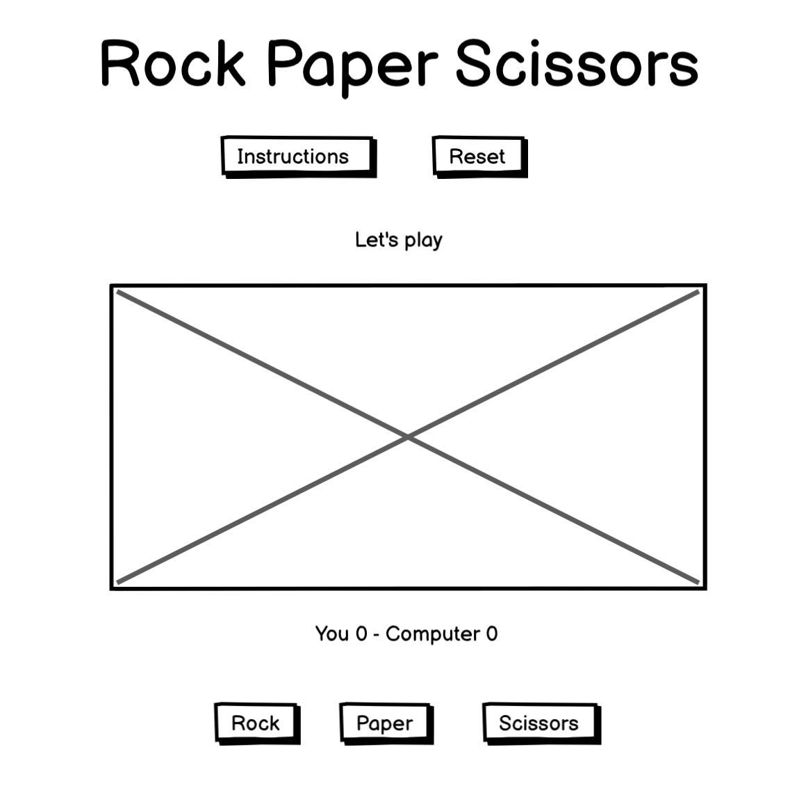
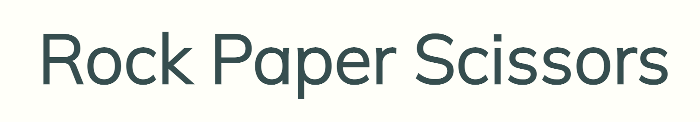
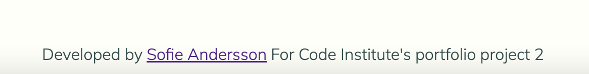

# Rock Paper Scissors - Portfolio project 2

This is a website for playing Rock Paper Scissors, the classic game where users compete against the computer in a game of chance, with the first to 10 wins. I decided to create this game and teach my four year old to play it at the same time. 

The aim of this project is to build an interactive front-end site which responds to the user's actions and altering the way the site displays information to achieve the user's game selections.

[Link to website](https://idamariasofie.github.io/rock-paper-scissors/)

# Contents

- UX & Design
- User Experience

  - User Stories

- Design

  - Colour Scheme

  - Typography

  - Imagery

  - Wireframes

- Features

  - General Features on Each Page
  -
  - Future Implementations
  -
  - Accessibility
  -
- Technologies Used

  - Languages Used
  - Frameworks, Libraries & Programs Used
  
- Deployment & Local Development

  - Deployment
  - Local Development
   
- Testing

- Credits

  - Code Used
  - Content
  - Acknowledgments

# **UX & Design**

As the site is a single-serving site, meaning there is only one page, I wanted to keep the design of the page simple and clean  Making it clear to the user entering this is a game page. 

### **User Stories**

Persona 1
Age 15-25 years
This is a person that loves simple and entertaning games online. 

Persona 2
Age 25-50 years
This is a person that would play this game as it reminds them of their childhood, creating a nostalic feeling. 

Persona 3
50-75 years
Since this is such a well-known game, I imagine people playing this at all ages of life, and it could be one of the first games to play when entering playing games online. 

##### **Wireframes**

I used Balsamiq to develop the wireframes for the website. This was the original idea, a few add on have been made when I started building the website and game, for example the game instructions. Since it made more sense to the game and made it more interactive with the user. 

Home page

##

### **Color Scheme**

I have used [Coolors](https://coolors.co/) to create the color scheme for the website. I wanted the game to have a clean and minimalistic look. Easy to understand and to interact with.

##

### **Typography**

I used [Google Fonts](https://fonts.google.com/) to find the font Mauri used for all site text. I like the simple yet expressive look of this font.

##

## **Features**

- **Logo**

  - The site logo appears at the top of the page and shows the user the name of the game.

- **Favicon**

  - The favicon on the browser tab contains a simple hand icon, this was created in Illustrator. The same icons are used for displaying the user selection while playing. 

- **Game Settings Buttons**
  - The game settings buttons allows the user to read instructions and reset the game.

- **Instructions**
  - The instructions button allows the user to see the game rules and instructions on how to play.

- **Reset**
  - The reset button allows the user to reset the game at any point while playing.

- **Modal Box with instructions**

  - The instructions modal box appears when the user clicks on the instructions button and gives the user a rundown on the game's rules and controls. The box can be closed by either clicking the "Play Game" button at the bottom or clicking anywhere outside of the box without disrupting the game.

- **Game Image**

  - When entering the page this image will show to the user. The idea was to create something estetic and easy to understand. I also wanted some icons that felt more "playfulness" adding some fun and creativity to the game. 

- **Game instructions**

- **Scoreboard**

  - The scoreboard displays the current score of the game clearly indicating the user's and computer's score. Making it easy for the user to follow along. 

- **Game Controls**

  - The game control buttons allows the user to choose rock, paper, or scissors when playing. I decided to turn the rock and scissors icons horizontally to make them more true to reality. 

 These icons were found on [FontAwesome](https://fontawesome.com/icons)

 

- **Footer**

  - The footer displays my name, the purpose of the project and a link to my Github that opens in a new tab. 
  

##

### **Features to implement**

- **Animation**

For the future it would be great to add animated icons to add another dimension to the game and make it even more professional and fun to play. 

### **Technologies Used**

The following is a list of the technologies I used on this project.

- [HTML5](https://en.wikipedia.org/wiki/HTML5)
  - HTML5 was used to create the structure of the site.
- [CSS3](https://en.wikipedia.org/wiki/CSS)
  - CSS3 was used to add styling to the site.
- [JavaScript](https://en.wikipedia.org/wiki/JavaScript)
  - JavaScript was used to add functionality to the game.
- [Google Fonts](https://fonts.google.com/)
  - Google Fonts was used to import the Mauri font for use on styles.css.
- [Github](https://github.com/)
  - Github was used to store the project's code after being pushed from Git.
- [Codeanywhere](https://gitpod.io/)
  - Gitpod terminal was used to commit my code using Git and push it to Github.
- [Balsamiq](https://balsamiq.com/)
  - Balsamiq was used to design the wireframes for the project.
- [Illustrator]
  - Illustrator was used to design the game icons for the game. 

## **Testing**

## Deployment

The site was deployed to GitHub pages. The steps to deploy are as follows:

- In the  [GitHub repository navigate to the Settings tab.
- From the source section drop-down menu, select the  **Main**  Branch, then click "Save".
- The page will be automatically refreshed with a detailed ribbon display to indicate the successful deployment.

## **Credits**

Favicon

- <https://www.w3schools.com/html/html_favicon.asp>
- Modal window
- <https://www.youtube.com/watch?app=desktop&v=o5ffh3KUaTM&pp=ygUeY3JlYXRlIG1vZGFsIHVzaW5nIGphdmFzY3JpcHQg>
- Modal window
<https://www.w3schools.com/howto/howto_css_modals.asp>
-Display icons when clicking on buttons 
https://www.w3schools.com/jsref/prop_style_visibility.asp 

### **Content**

- All website text content on the website was written and created by me. 

### **Design**

### **Media**

## **Acknowledgements**

I would like to give special thanks to my mentor,  Luke for his guidance during the development of this project.

