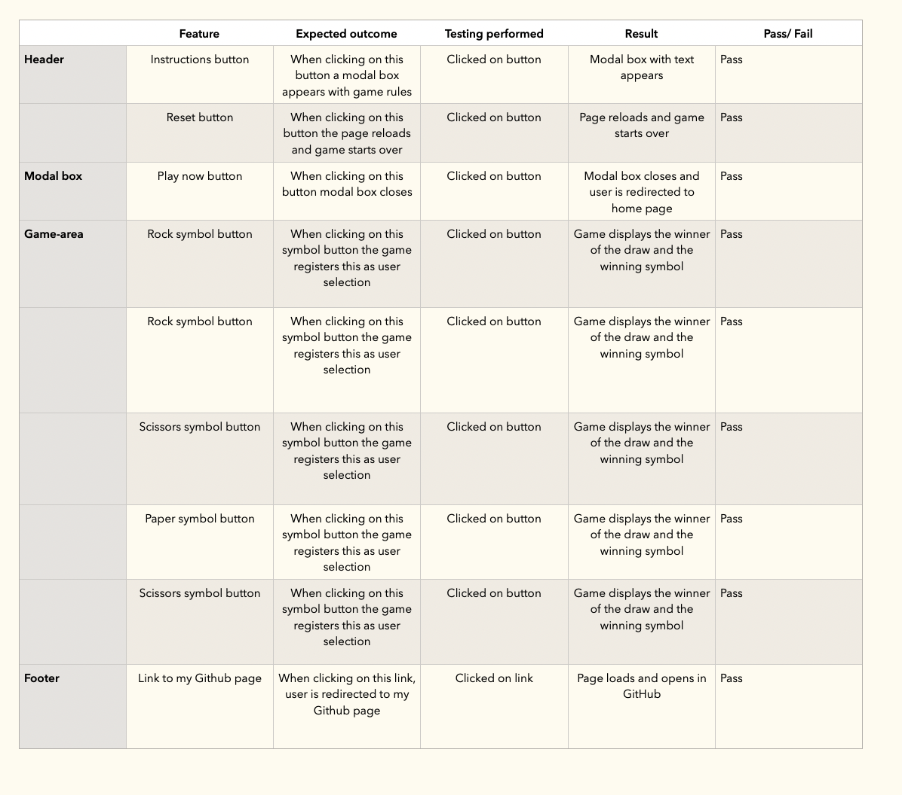

# Rock Paper Scissors - Portfolio project 2

This is a website for playing Rock Paper Scissors, the classic and familiar game where users compete against the computer in a game of chance, with the first to 10 wins. I decided to create this game, and teach my four year old to play it at the same time. 

The aim of this project is to build an interactive front-end site which responds to the user's actions and altering the way the site displays the winner of the draw. 

[Link to website](https://idamariasofie.github.io/rock-paper-scissors/)

## Contents

* UX & Design (#ux-design) 
* User Stories (#user-stories)

* Design (#design)
* Wireframe (#wireframe)
  * Color Scheme (#color-scheme)
  * Typography (#typography)
  * Logo (#logo)
  * Favicon (#favicon)
  * Game settings buttons (#game-settings-buttons)
  * Modal box (#modal-box)
  * Game image (#game-image)
  * Game instructions (#game-instructions)
  * Scoreboard (#scoreboard)
  * Game controls (#game-controls)
  * Footer (#footer)
  

* Features (#features)
  * Future Implementations (#future-implementations)
  * Bugs and challenges (#bus-and-challenges)
  * Technologies Used (#technologies-used)
  * Languages Used (#languages-used)
  
* Deployment (#deployment)

  * Deployment (#deployment)

* Testing (#testing)

* Credits (#credits)
  
* Code Used (#code-used)
* Content (#content)
* Acknowledgments (#acknowledgements)

## UX & Design

As the site is a single-serving site, meaning there is only one page, I wanted to keep the design of the page simple and clean  Making it clear to the user visiting the website this is a game page. 

### User Stories

Persona 1
Age 4-15 years
One of the first games you learn to play as a child. Fun to play and to learn at the same time online. 

Persona 2
Age 15-50 years
This is a person that would play this game as it reminds them of their childhood, creating a nostalic feeling. 

Persona 3
50-75 years
Since this is such a well-known game, I imagine people playing this at all ages of life.  

## Design

## Wireframe

I used Balsamiq to develop the wireframes for the website. This was the original idea, a few add ons have been made when I started building the website and game, for example the game message instruction box, declaring the winner of of each draw and the game. Since it made more sense to the game and made it more interactive. 

Home page

##

### Color Scheme

I have used [Coolors](https://coolors.co/) to create the color scheme for the website. I wanted the game to have a clean and minimalistic look. Easy to understand and to interact with.

##

### Typography

I used [Google Fonts](https://fonts.google.com/) to find the font Mauri used for all site text. I like the simple yet expressive look of this font.

##

### *Loo*

  - The site log appears at the top of the page and shows the user the name of the game.

### Favicon

  - The favicon on the browser tab contains a simple hand icon, this was created in Illustrator. 
  - 

### Game Settings Buttons
- 
  - The game settings buttons, allows the user to read game instructions and reset the game at any time.

### Modal Box

  - The instructions modal box appears when the user clicks on the instructions button, and gives the user a rundown on the game's rules. The box can be closed by clicking the "Play now" button at the bottom. 
  - 

### Game Image

  - When entering the page this image will show to the user. The idea was to create something estetic and easy to understand. I also wanted some icons that felt more "playfull" adding some fun and creativity to the game. 

### Game instructions

### Scoreboard

  - The scoreboard displays the current score of the game clearly indicating the user's and computer's score. Making it easy for the user to follow along. 

### Game Controls

  - The game control buttons allows the user to choose rock, paper, or scissors when playing. I decided to turn the rock and scissors icons horizontally to make them more true to reality. 

 These icons were found on [FontAwesome](https://fontawesome.com/icons)

 

### Footer

  - The footer displays my name, the purpose of the project and a link to my Github that opens in a new tab. 
  

##

## Features to implement

- **Animation**

For the future it would be great to add animated icons to add another dimension to the game and make it even more professional and fun to play. I would also like the game to end automatically when either the user or computer wins the game.  

## Bugs and challenges 

There were several bugs I came across while developing this game:

The favicon icon appeared not to load regardless of the way I was trying to upload it to the root directory. Both options were unsuccessfull to load the icon. I have tried option of copying the code from the website and uploading the whole folder to the directory and the one advised on Love Maths project with single line of code under the Title and single file upload. In the end the icon did appear on the deployed version of the website only, so it was decided to leave it as it is.
Quiz questions functions bug was the most challenging as JS file stopped working when getting to the certain line for the code, and from many more than 'first glance' JS code was perfectly fine on all line for the file. After long time of research I managed to find the bug in the HTML file. As this version of repository was created as a copy of the first draft and most of the code was copied directly to the directory from the version that was created first, thus some lines were simply overwritten.
Also minor background bug was easily fixed. Background image appeared to move/shake everytime new button came up or ckicked on. First I tried to fix this issue with reducing borders of the buttons but later on I have managed to perfectly place the background with some extra css code.

## Technologies Used

The following is a list of the technologies I used on this project.

GitHub – storage and deployment
Codeanywhere – IDE used to write, edit, commit and push the code to GitHub
Google Fonts – import font
Font Awesome –used to find icons for buttons
Balsamiq – Balsamiq was used to design the wireframe
Am I Responsive? – check responsiveness of the website
Illustrator – used to design the game icons and favicon
Coolors – create color palette

## Languages Used

HTML, CSS, JAVASCRIPT

## Deployment

The site was deployed to GitHub pages. The steps to deploy are as follows:

* In the [GitHub repository navigate to the Settings tab.
* From the source section drop-down menu, select the  **Main**  Branch, then click "Save".
* The page will be automatically refreshed with a detailed ribbon display to indicate the successful deployment.

## Testing

HTML - validation

## Credits

Favicon info: <https://www.w3schools.com/html/html_favicon.asp>

How to create a modal box: <https://www.youtube.com/watch?app=desktop&v=o5ffh3KUaTM&pp=ygUeY3JlYXRlIG1vZGFsIHVzaW5nIGphdmFzY3JpcHQg>

How to create a modal box:
<https://www.w3schools.com/howto/howto_css_modals.asp>

Style visibility display: 

https://www.w3schools.com/jsref/prop_style_visibility.asp 

Game messages for user:

Stick Kick project by Adam Gilroy 

<https://github.com/adamgilroy22/stick-kick>

Reset button:

<https://www.freecodecamp.org/news/refresh-the-page-in-javascript-js-reload-window-tutorial/#:~:text=You%20can%20use%20the%20location>,method%20responsible%20for%20page%20reloading.

Rock, paper, scissors button icons:

www.fontawesome.com

Rock, paper, scissors icons/images:

Made by me in Illustrator. 

### Content

- All website text content on the website was written and created by me.
- Game instructions text inspired by <https://cs.stanford.edu/people/eroberts/courses/soco/projects/1998-99/game-theory/psr.html#:~:text=Rock%2C%20Paper%2C%20Scissors>,beats%20rock%20by%20covering%20it.

## Acknowledgements

I would like to give special thanks to my mentor, Luke for his guidance during the development of this project.

